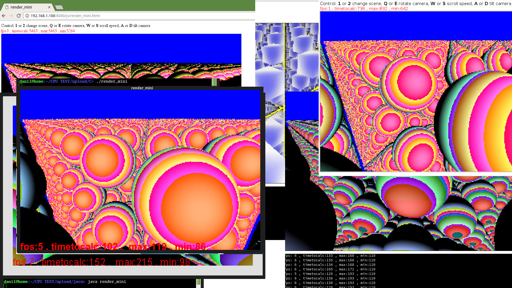
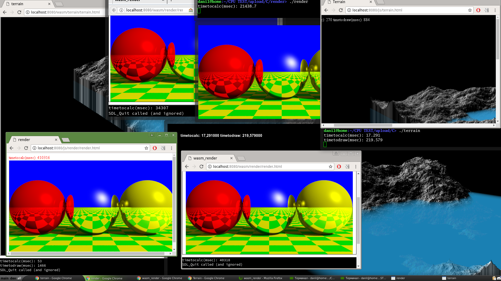

wasm/js/java/C++ CPU tests
-

**what is it**- *Comparison of calculation speed and drawing speed*

*todo* - OpenGL drawing test(or game)

### Live test

name     | wasm | javascript
-------- | ----------- | ---
basic |   [wasm_basic](https://danilw.github.io/cputests/wasm/basic/basic.html)      | [js_basic](https://danilw.github.io/cputests/js/basic.html)
terrain   | [wasm_terrain](https://danilw.github.io/cputests/wasm/terrain/terrain.html)        | [js_terrain](https://danilw.github.io/cputests/js/terrain.html)
render     | [wasm_render](https://danilw.github.io/cputests/wasm/render/html/render.html)      |  [js_render](https://danilw.github.io/cputests/js/render/render.html)    
 render_mini  |     [wasm_render_mini](https://danilw.github.io/cputests/wasm/render_mini/render_mini.html)      |  [js_render_mini](https://danilw.github.io/cputests/js/render_mini.html)

### Result

**render_mini** - animated(live move camera) 3d scene render (software(CPU) render without GPU))

Camera control (in all versions same):1 or 2 change scene, Q or E rotate camera, W or S scroll speed, A or D tilt camera

Edit (source code) *viewWidth* and *viewHeight* to change render resolution (current for test 300x200) also *viewScaleX/Y* to set image Scale, *disable_ani* to True will disable animations.

tester     | timetocalc(msec) 
-------- | ----------- 
firefox |  700-1000
js45   |  1000-1200
chrome     |  5500-6500
 java    |    90-210 (fps 8)
 C++    |    80-120 (fps 8)
wasm  chrome    |   120-150 (fps 6)
wasm  firefox    |   150-200 (fps 4)

**render** - 3d scene render with shadows and reflection (software(CPU) render without GPU))

tester     | timetocalc(sec) 
-------- | ----------- 
firefox |  367 (6.1 min)
js45   |   387 (6.5 min)
chrome     |   410 (6.8 min)
 java    |    28
 C++    |    21   
wasm  chrome    |   41 
wasm  firefox    |   34

**terrain** - recursion with lambda expressions in logic, and draw 2d map

tester     | timetocalc(msec) | timetodraw(msec)
-------- | ----------- | ---
firefox |   30-60      | 1000
js45   | 17-35         | --
chrome     |   200-250       | 800-900
 java  Graphics2D  |    170-220      | 2200-3000 
 C++  cairo  |    10-50      | 250-350 
wasm  chrome  sdl  |   50-60       | 1200-1500 
wasm  firefox  sdl  |  30-35       | 800-1000 

**basic**- simple memory copy, string concat, number to string

tester     | timetocalc(sec) 
-------- | ----------- 
firefox |  15
js45   | 15  
chrome     |   22
 java    |    20
 C    |    11   
wasm  chrome    |   44 
wasm  firefox    |   55

soft version: 
openjdk version "9-internal", 
Chrome 58.0, 
Firefox 52.1, 
gcc-5, 
Emscripten 1.37.9

### Building
**read**  [build_readme.md](build_readme.md)

### Graphic

